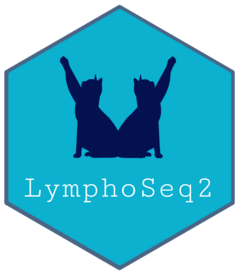

<!-- README.md is generated from README.Rmd. Please edit that file -->

```{r, include = FALSE}
knitr::opts_chunk$set(
  collapse = TRUE,
  comment = "#>",
  fig.path = "man/figures/README-",
  out.width = "100%"
)
```

<!-- Logo was obtained from this public domain link https://www.publicdomainpictures.net/en/view-image.php?image=149252&picture=cat-stretch-black-silhouette -->
# LymphoSeq2 <a href="https://shashidhar22.github.io/LymphoSeq2"></a>


<!-- badges: start -->
[](https://github.com/shashidhar22/LymphoSeq2/actions)
<!-- badges: end -->

## Overview
 
Adaptive Immune Receptor Repertoire Sequencing (AIRR-seq) provides a unique opportunity to interrogate the adaptive
immune repertoire under various clinical conditions. The utility offered by this technology has quickly garnered interest
from a community of clinicians and researchers investigating the immunological landscapes of a large spectrum of health
and disease states. LymphoSeq2 is a toolkit that allows users to import, manipulate and visualize AIRR-Seq data from various 
AIRR-Seq assays such as Adaptive ImmunoSEQ and BGI-IRSeq, with support for 10X VDJ sequencing coming soon. The platform 
also supports the importing of AIRR-seq data processed using the MiXCR pipeline. The vignette highlights some of the key features of LymphoSeq2.

## Installation

To install the latest version of LymphoSeq2 you can use the `devtools` package and install LymphoSeq2 from GitHub
``` r
# install.packages("devtools")
devtools::install_github("shashidhar22/LymphoSeq2", build_vignettes = TRUE)
```

## Getting started

To import AIRR-Seq data using `LymphoSeq2` we can use the `readImmunoSeq` function. Currently the function can import data from MiXCR, Adaptive ImmunoSEQ, BGI IR-SEQ, and 10X Genomic single cell VDJ rearrangements. 

```{r import_data}
library(LymphoSeq2)
study_files <- system.file("extdata", "TCRB_sequencing", package = "LymphoSeq2")
study_table <- LymphoSeq2::readImmunoSeq(study_files)
```

To get a quick summary of repertoire characteristics, use the `clonality` function. This will calculate many standard repertoire diversity metrics such `clonality`, `gini coefficient`, `convergence`, and `unique productive sequence` for each of the repertoires in the input dataset.

```{r summary_statistics}
summary_table <- LymphoSeq2::clonality(study_table)
summary_table
```

To compare samples with varying depth of sequencing, you can use the `clonality` function to sample down all repertoires to a minimum number of sequences. Since we randomly sample sequences from each repertoire, in this mode the `clonality` function will repeat this operation for a user specified number of `iterations` and caculate the average value for all the diversity metrics.

```{r iterative_summary}
sampled_summary <- LymphoSeq2::clonality(study_table, rarefy = TRUE, iterations = 5, min_count = 1000)
sampled_summary
```
